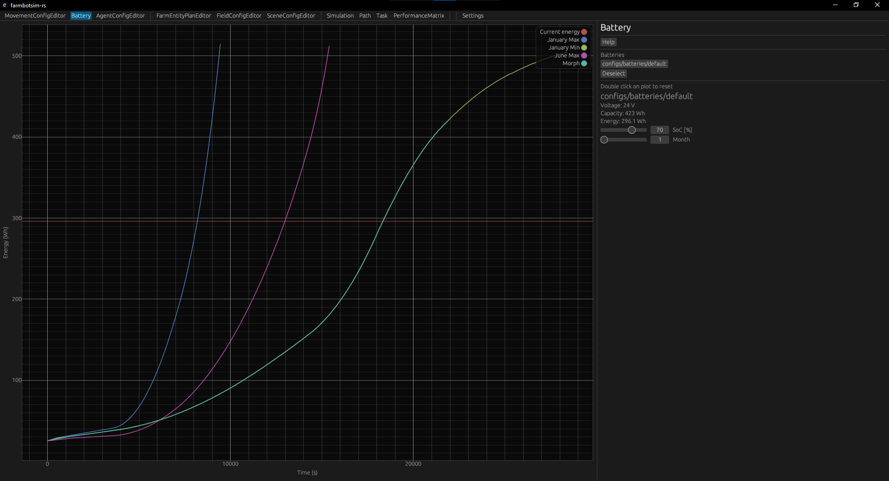
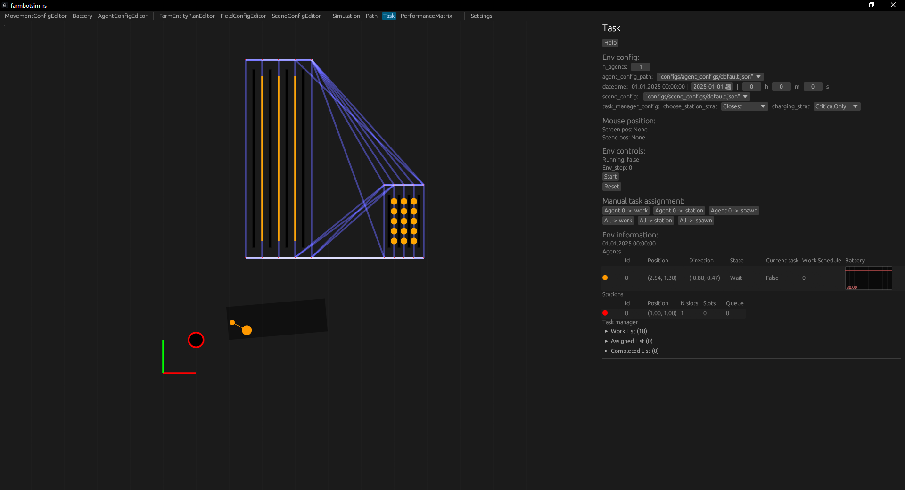

# farmbotsim

**!! IN DEVELOPMENT !!**

**You can download the latest version of this application from the Releases page (Windows only).**

---

**farmbotsim-rs** was made to assist with real-world agricultural automation by providing a reliable simulation. In this simulation we can focus on charging strategies and productivity matrix.
<details>
<summary><strong>Screenshots of application:</strong></summary>







</details>

## Table of Contents
- [Prerequisites](#prerequisites)
- [Installation](#installation)
- [Usage](#usage)
- [Code Structure Overview](#code-structure-overview)

## Prerequisites

Before getting started, you need to have **[Rust](https://www.rust-lang.org/tools/install)** installed on your machine.

Additionally, it's recommended to have **[Git](https://git-scm.com/)** installed to clone the repository.

## Installation

Follow these steps to get farmbotsim running locally:

1. Clone the repository:
   ```bash
   git clone https://github.com/Axstr0n/farmbotsim-rs.git
   ```

2. Navigate to the project directory:
    ```bash
    cd farmbotsim-rs
    ```

## Usage
After installation you can run main file like:
```
cargo run
```
This will run whole application. (Note: running first time takes longer to build)

## Building project
To build the project in release mode use:
```bash
cargo build --release
```

## Code Structure Overview

The **farmbotsim-rs** project is organized into several directories that help separate functionality. Here's a high-level breakdown:


`configs/`
- `agent_configs/` - Contains agent configs. (movement + battery)
- `batteries/` - Contains battery configs.
- `farm_entity_plans/` - Contains plans for farm entity growth.
- `field_configs/` - Contains parameters for field config. (field)
- `movement_configs/` - Contains movement configs. (movement)
- `scene_configs/` - Contains parameters for scene config. (field + stations + spawn area)

`media/`- Contains screenshots of app.

`performance_matrix/` - Stores all evaluations

`src/` - Contains the core logic of the application:
- `agent_module/` - Contains the agent struct and its associated logic, such as movement, battery, state machine.
- `app_module/` - Main app functionality.
- `environment/` - Contains all environment structs (Crop, Field, Station, Env, Config, ...).
  - `env_module/` - Contains logic for env.
  - `farm_entity_module/` - Contains logic for farm entity.
  - `spawn_area_module/` - Contains logic for spawn area.
  - `station_module/` - Contains logic for station.
  - `...`
- `path_finding_module/` - Includes code related to navigation and pathfinding algorithms.
- `rendering/` - Responsible for rendering.
- `task_module/` - Includes files for task creation and task handling.
- `tool_module/` - Contains files for app modes (simulation, editor, path, task, ...).
- `units/` - Unit system.
- `utilities/` - Common utilities and helper functions used across the project.
- `cfg.rs` - Contains constants.
- `logger.rs` - Logger for application.
- `main.rs` - Contains entry point into application.

`.gitignore` - Ignores files/folders.

`Cargo.lock` - Records the exact versions of dependencies used for this project.

`Cargo.toml` - Contains dependencies of project.

`README.md` - This file, which contains documentation and instructions for setting up and using the application.
